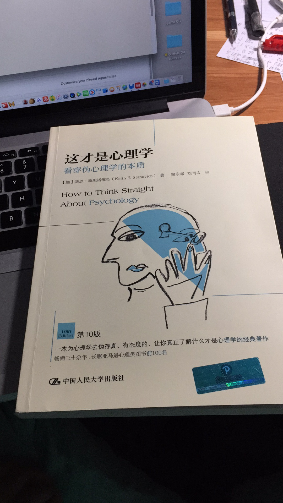
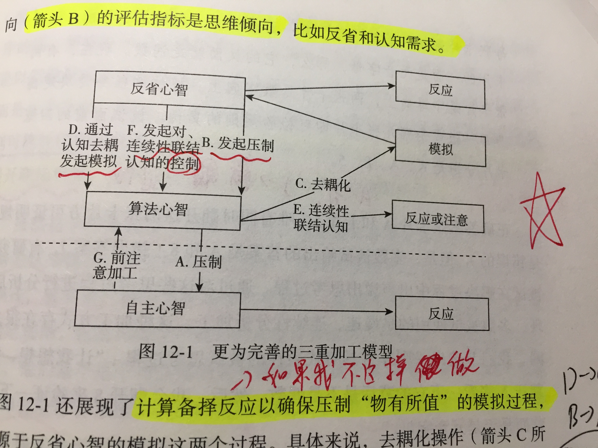
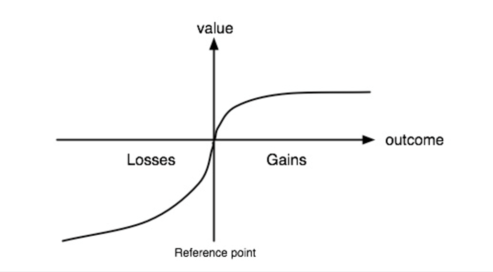
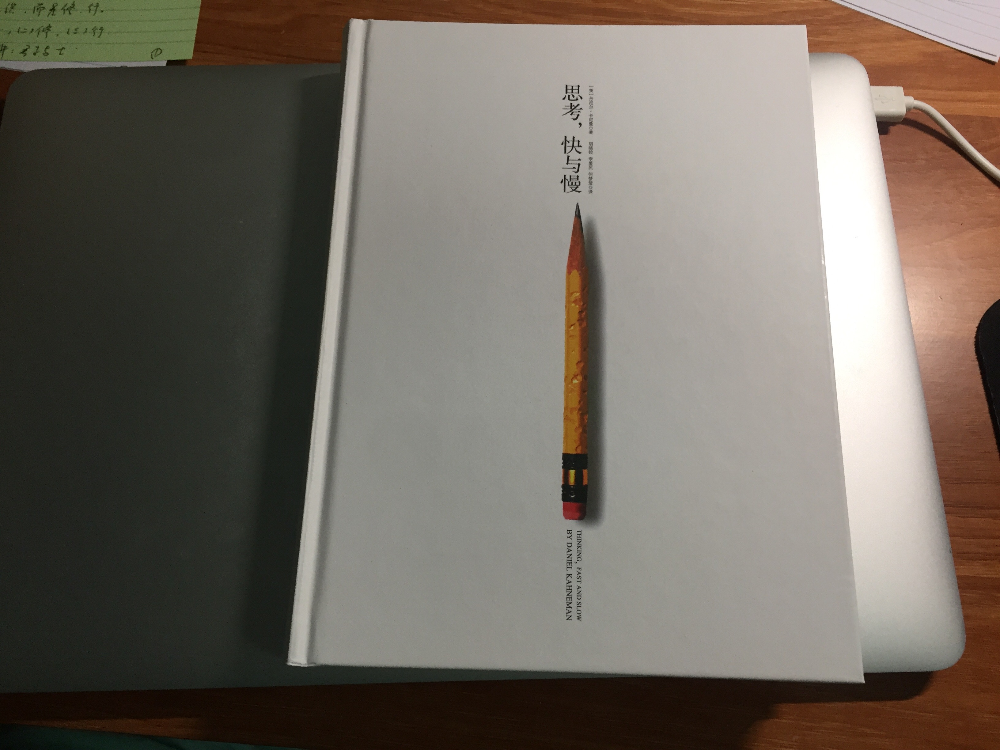
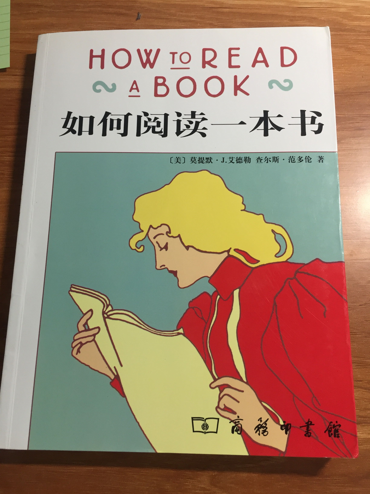
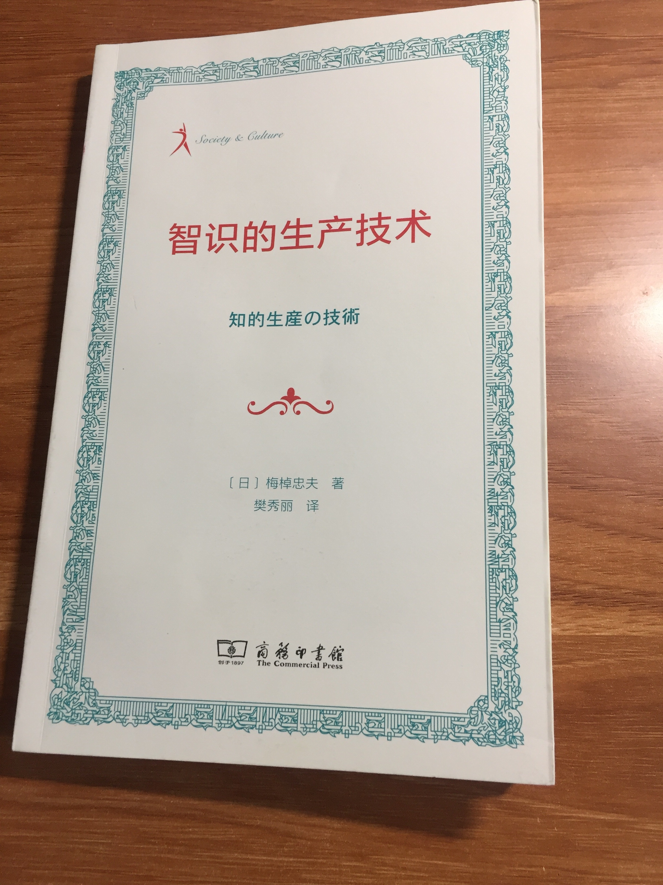

***共计六本：理性思维 3 本，学习方法 2 本，文学指导 1 本。***
---
* 书名：《才是心理学》－ 基思.斯坦诺维奇
* 分类：心理学
* 复述：此书为心理学平反，***心理学是以实验心理学为根基的科学***，***不是玄学***。对，心理学像物理化学一样是科学。
* 我的心得：***科学的基本三点（基于现实观察而不是YY／可公开重复，进行同行审阅／可证伪［重点］ ）概率统计思维［重点］，不相信个人案例与个人陈述能当作证据（安慰剂效应），用故事的鲜活性去表达观点***。这本书应该人手一本，这样社会脑残就不会那么多了。
* 与之相联系的书籍：《实验心理学》《概率统计》《不确定世界的理性选择》《思考，快与慢》关于证伪参考《魔鬼出没的世界》（反例龙喻）波普尔（可证伪提出者）《猜想与反驳》
  
 
* 《超越智商》－基思.斯坦诺维奇
* 分类：心理学
* 复述：智商测试测不出许多东西，因此高智商的人也会做荒谬事儿，即患有理性障碍。作者***将智商与理性分离***，重点讲述从双重加工理论到本书真正核心***三类心智模型***（自主心智，算法心智，反省心智）
* 我的心得：算法心智是智商，即平时说的聪明，代表速度，效率；反省心智是理性（rational thought)，代表方向。速度和方向哪个重要不言而喻吧？我才20来岁已经见过不少天资不错但是荒废大脑的人了，不还是方向不对么。反省心智：发起压制，发起模拟活动，发起对连续性联结认知的控制。本书与《这才是心理学》一个作者，因此同样强调了普通人应该安装正确的心智程序：证伪思维，贝叶斯定律，基础逻辑学，摆脱框架效应，认知吝啬鬼（注重生动，出众）。我要加强：证伪思维，概率思维，***备择假设引发的相关知识点（从对立面思考事物！！！逆向思维！！！）***
  

* 《实验心理学》《概率统计》《思考，快与慢》关于证伪参考《魔鬼出没的世界》（反例龙喻）波普尔（可证伪提出者）《猜想与反驳》

* 书名：《思考快与慢》－丹尼尔.卡尼曼
* 分类：认知科学／经济学
* 复述：主要讲人其实是非理性的，很多决策并不是深思熟虑决定的，而是由大脑中系统1（自发性思维）决定，大篇幅描述了系统1的各种缺陷，人的大脑自带偏见。
* 我的心得：整本书其实囫囵吞枣看完，因为翻译实在很别扭，而且感觉说了好多废话，其实可以很精简的，精简到只看后面附上的两个论文本书即可：
  * 1不确定下的判断：启发法和偏见
  * 2选择，价值及框架。（提出了著名的[前景理论](https://zh.wikipedia.org/wiki/%E5%B1%95%E6%9C%9B%E7%90%86%E8%AE%BA)此理论让作者获得诺贝尔奖）
    前景理论可用一个曲线概括（下图），人得到和失去的曲线斜率不同，***人因厌恶损失对收益和损失具有不对称心理。***另外这本书让我知道了我的功力再足一些时，**可以直接看外国最新论文了，没必要啃书。所以英语原版阅读该赶紧加上来**。另外得知了，锚定效应，框架效应，还因为此书看了《12怒汉》。
* 相关联的书：《超越智商》（本书双系统的源头）
  
* 书名：《如何阅读一本书》
* 分类：阅读类工具书
* 复述：为了提升心智，增长理解力而阅读。四个层次阅读：基础，检视（略读），分析（精读），主题。
* 我的心得：[走出读书行为瘫痪](http://www.huyuning.com/%E8%AF%BB%E4%B9%A6/2017/09/18/%E5%AF%B9%E6%88%91%E6%9C%89%E6%95%88%E7%9A%84%E8%AF%BB%E4%B9%A6%E6%B3%95.html)
  
* 书名：《智识的生产技术》
* 分类：阅读类工具书
* 复述：讲了读，写，整理文档等需要从事智识生产相关活动的所有事。
* 我的心得：卡片大法好。卡片为了减少认知负荷，但是卡片绝不是积累装置，而是创造装置。
  
* 书名：《文心》
* 分类：语文
* 复述：通过一个小说来讲述语文的基本知识。
* 我的心得：相见恨晚。让我知道了小说和叙事文和议论文的区别。强推。
  

附[我的豆瓣](https://www.douban.com/people/148687401/)